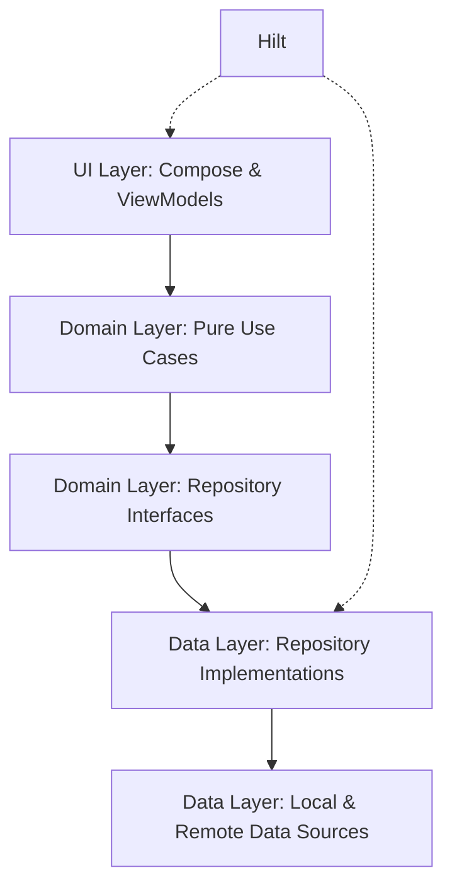

# 🧠 Mobile AI Suite

[](https://developer.android.com)
[](https://kotlinlang.org)
[](https://dagger.dev/hilt/)
[](https://developers.google.com/mediapipe)
[](https://ai.google.dev/)

A high-performance Android laboratory demonstrating the convergence of **Cloud-based Generative AI**
and **Edge-based Computer Vision**. This suite is built for Mobile AI Engineers who prioritize low
latency, privacy-first on-device processing, and modern architectural excellence.

---

## 🚀 Key AI Features

### 1. 🌌 Gemini AI Chat (Generative AI)

Leveraging the power of **Google Gemini 3.6 Flash** to provide sophisticated multi-modal reasoning.

- **Multi-modal Inputs**: Seamlessly process both text and high-resolution bitmaps.
- **Response Streaming**: Implementation of `Flow<String>` for real-time token delivery, reducing
  perceived latency.
- **Async Processing**: Powered by Kotlin Coroutines for non-blocking UI interactions.

### 2. 👁️ Local Object Detection (Edge Vision)
Ultra-low latency vision system running 100% on-device via **MediaPipe**.
- **Edge Inference**: Utilizes `efficientdet_lite0.tflite` for real-time bounding box prediction.
- **CameraX Integration**: High-performance image analysis with automatic rotation handling.

### 📴 3. Offline AI Chat (Local LLM)
Secure, private conversation powered by **Google Gemma 2B** (INT4 Quantized).
- **On-Device LLM**: Runs locally via `tasks-genai`, ensuring data never leaves the device.
- **Hardware Optimized**: Leverages GPU compute shaders for accelerated inference.

### 4. 🤖 Smart AI Chat (Hybrid Orchestrator)
A sophisticated hybrid engine that orchestrates between on-device and cloud models.

- **Edge-First Logic**: Attempts to process requests locally via Gemma for zero-latency and offline
  availability.
- **Cloud Fallback**: Automatically switches to Gemini 3.6 Flash if local hardware is insufficient
  or the model is not ready.
- **Connectivity Aware**: Real-time network monitoring to determine optimal routing.

---

## 🏗️ Architectural Blueprint

This project follows an advanced **Clean Architecture** implementation with strict separation of concerns.



### 💎 Engineering Excellence
- **Domain Purity**: Use Cases are written in pure Kotlin, remaining agnostic of the Android Framework or UI strings.
- **Unified State Pattern**: Each screen is backed by a single, immutable `State` data class (e.g., `GeminiState`), ensuring atomic UI updates.
- **Flow Throttling**: Custom `chunkedByTime` operator prevents UI flickering during high-frequency AI streaming.
- **Modern Navigation**: Type-safe navigation with centralized `Screen` definitions.

---

## 🧪 Robust Testing
The project includes a comprehensive unit test suite achieving high coverage across all logic-heavy layers.
- **Mocking**: Powered by **MockK** for deep dependency isolation.
- **Flow Verification**: Uses **Turbine** for safe and expressive testing of asynchronous AI streams.
- **Deterministic UI**: Custom `MainDispatcherRule` ensures predictable ViewModel testing.

---

## 🛠️ Technical Stack

| Category         | Technology                            |
|:-----------------|:--------------------------------------|
| **UI Framework** | Jetpack Compose (Material 3)          |
| **AI Stack**     | MediaPipe Vision/GenAI, Google AI SDK |
| **Local LLM**    | Gemma 2B (INT4 Quantized)             |
| **Architecture** | Clean Architecture                    |
| **Concurrency**  | Kotlin Coroutines & Flow              |
| **DI & Testing** | Hilt, MockK, Turbine, JUnit 4         |

---

## ⚡ Setup Guide

### 1. Gemini API Integration
1. Obtain an API Key from [Google AI Studio](https://aistudio.google.com/).
2. Add it to your `local.properties`:
   ```properties
   GEMINI_API_KEY=your_secure_api_key
   ```

### 2. Edge Model Setup
- **Vision**: Place `efficientdet_lite0.tflite` in `app/src/main/assets/models/`.
- **LLM**: Push `gemma-2b-it-gpu-int4.bin` to `context.filesDir` via Device File Explorer.

---

## 📚 Technical Insights

- **Image Analysis**: We use `ImageAnalysis.STRATEGY_KEEP_ONLY_LATEST` to ensure the on-device model
  never falls behind the live camera feed.
- **Session-Based Inference**: The offline chat uses `LlmInferenceSession` to maintain context and
  sampling settings (like temperature) independently of the main inference engine.
- **Memory Management**: Automatic closing of `ImageProxy`, `ObjectDetector`, and
  `LlmInferenceSession` instances to prevent memory leaks and free up GPU resources.
