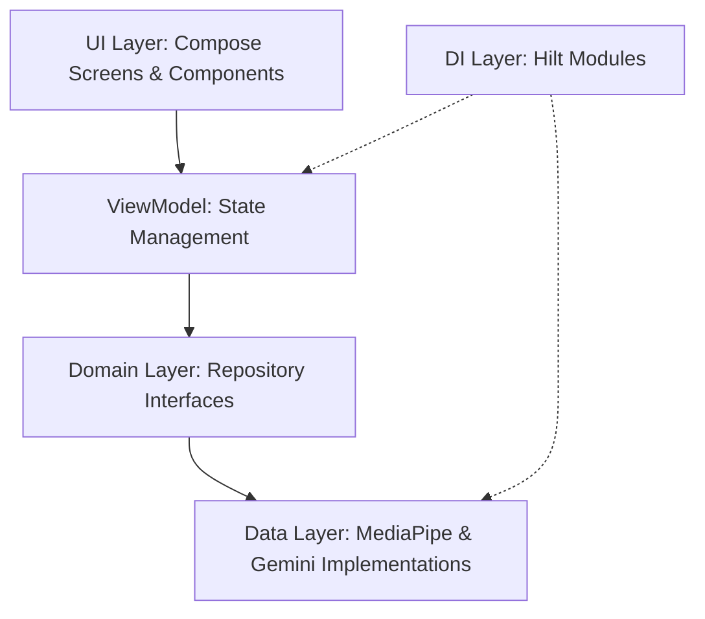

# 🧠 Mobile AI Suite

[](https://developer.android.com)
[](https://kotlinlang.org)
[](https://dagger.dev/hilt/)
[](https://developers.google.com/mediapipe)
[](https://ai.google.dev/)

A high-performance Android laboratory demonstrating the convergence of **Cloud-based Generative AI** and **Edge-based Computer Vision**. This suite is built for Mobile AI Engineers who prioritize low latency, privacy-first on-device processing, and modern architectural excellence.

---

## 🚀 Key AI Features

### 1. 🌌 Gemini AI Chat (Generative AI)
Leveraging the power of **Google Gemini 3.6 Flash** to provide sophisticated multi-modal reasoning.
- **Multi-modal Inputs**: Seamlessly process both text and high-resolution bitmaps.
- **Response Streaming**: Implementation of `Flow<String>` for real-time token delivery, reducing perceived latency.
- **Async Processing**: Powered by Kotlin Coroutines for non-blocking UI interactions.

### 2. 👁️ Local Object Detection (Edge AI)
Ultra-low latency vision system running entirely on-device via **MediaPipe**.
- **Edge Inference**: Utilizes `efficientdet_lite0.tflite` for real-time bounding box prediction.
- **Hardware Acceleration**: Optimized for mobile NPU/GPU inference.
- **CameraX Pipeline**: High-performance image analysis buffer integration with automatic rotation handling.

### 📴 3. Offline AI Chat (Local LLM)
Secure, private conversation powered by **Google Gemma 2B** running 100% on-device.
- **On-Device LLM**: Implementation of `tasks-genai` for local inference without data leaving the device.
- **Session-Based Inference**: Uses `LlmInferenceSession` for optimized GPU resource management and sampling control.
- **Reactive Streaming**: Real-time token streaming using `SharedFlow` for a responsive chat experience.

---

## 🏗️ Architectural Blueprint

This project serves as a reference for **Clean Architecture** and **SOLID Principles** in a modern Android ecosystem.



### 💎 Engineering Excellence
- **SOLID Principles**: 
    - *Dependency Inversion*: Features interact with `GeminiRepository`, `ObjectDetectorRepository`, and `OfflineChatRepository` interfaces.
    - *Single Responsibility*: Specialized core services like `PermissionManager` and data helpers like `LLMInferenceHelper` handle specific cross-cutting concerns.
- **State Management**: Reactive UI powered by `StateFlow` and `collectAsStateWithLifecycle`.
- **Decoupled Logic**: Permission handling is extracted into a dedicated `core.permission` service layer.
- **Modular UI**: Large composables are decomposed into granular, reusable units (e.g., `OfflineChatScreen`, `GeminiResponseArea`).

---

## 🛠️ Technical Stack

| Category | Technology |
| :--- | :--- |
| **UI Framework** | Jetpack Compose (Material 3) |
| **AI Processing** | MediaPipe (Vision & GenAI), Google AI SDK |
| **Local LLM** | Gemma 2B (INT4 Quantized) |
| **Concurrency** | Kotlin Coroutines & Flow |
| **Dependency Injection** | Hilt |
| **Navigation** | Navigation Compose (Type-safe) |
| **Camera Feed** | CameraX (ImageAnalysis) |
| **Build System** | Gradle Version Catalog (libs.versions.toml) |

---

## ⚡ Setup for AI Engineers

### 1. Gemini API Integration
1. Obtain your API Key from [Google AI Studio](https://aistudio.google.com/).
2. Secure the key in your `local.properties`:
   ```properties
   GEMINI_API_KEY=your_secure_api_key
   ```
   *The project uses the `Secrets Gradle Plugin` to prevent key exposure.*

### 2. Edge Model Configuration
- **Vision**: Place `efficientdet_lite0.tflite` in `app/src/main/assets/models/`.
- **LLM**: The project expects `gemma-2b-it-gpu-int4.bin` in the app's internal files directory (`context.filesDir`). This can be pushed via Android Studio's **Device File Explorer**.

### 3. Permission Strategy
The app utilizes a centralized `PermissionManager` injected via Hilt. To request permissions in a new screen:
```kotlin
PermissionHandler(
    permission = Manifest.permission.CAMERA,
    onResult = { isGranted -> /* Handle state */ }
)
```

---

## 📚 Technical Insights
- **Image Analysis**: We use `ImageAnalysis.STRATEGY_KEEP_ONLY_LATEST` to ensure the on-device model never falls behind the live camera feed.
- **Session-Based Inference**: The offline chat uses `LlmInferenceSession` to maintain context and sampling settings (like temperature) independently of the main inference engine.
- **Memory Management**: Automatic closing of `ImageProxy`, `ObjectDetector`, and `LlmInferenceSession` instances to prevent memory leaks and free up GPU resources.
